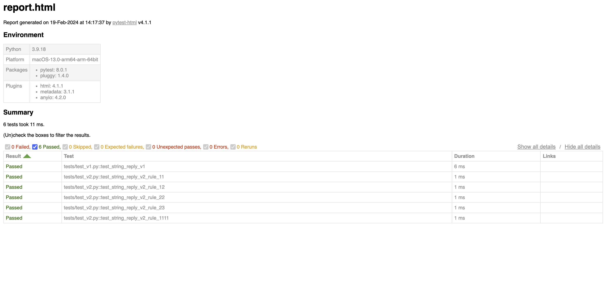

# string-reply
```
Python version : 3.9.18
```

### Install requirements
```
>> pip install -r requirements.txt
```

### Start server
```
>> uvicorn api.main:_get_app --port 8080 --host 0.0.0.0
```

### Run test cases
```
>> python -m pytest ./tests
```

### Swagger endpoint
```
http://localhost:8080/docs
```


### Notes
- In `string_reply/rules.py`, we have a class defination `Rules` where we have rule functions which we use one rule as one function, which is scalable, allowing us to add as many rules as we want.
- Rules are not limited to two digits; we can run as many rules as we want on the given string. For example, the input string could be like `121-kbzw9ru`.
- Test cases location `tests/test_v1.py`, `tests/test_v2.py`


### Pytest report

